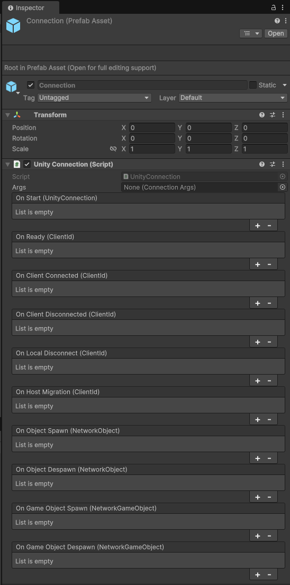
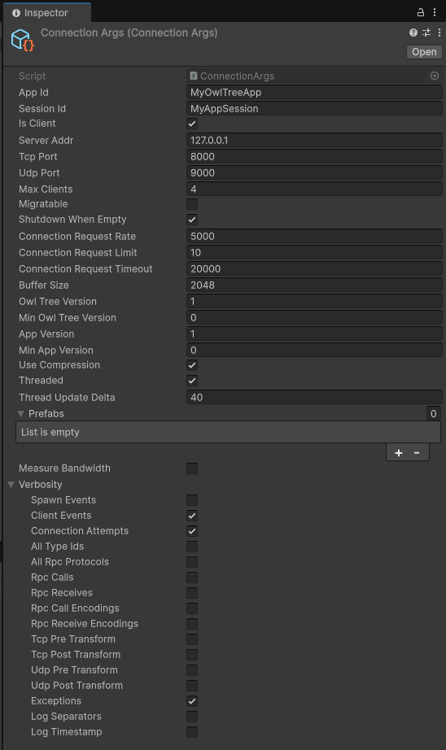
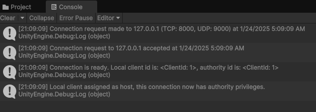

# OwlTree Unity Add-On

Add-on that provides OwlTree support for Unity. This includes the latest OwlTree version,
as well as other add-ons that will provide extra utility within Unity.

## Set-Up

To add OwlTree to your Unity project, download the latest unity package [here](https://github.com/CaptainToTo/owl-tree-unity/releases), and import it into your project.

Thats It!

You can read more about how to use OwlTree in Unity from the [wiki](https://github.com/CaptainToTo/owl-tree-unity/wiki).

## Making A Connection

OwlTree.Unity's primary interface is the `UnityConnection` component. Create a new empty gameobject,
and attach a `UnityConnection` to it, then make it a prefab. 



Then, right click on the Project/File Explorer window
and select Create > OwlTree > ConnectionArgs. This scriptable object contains arguments that will
be used configure a connection. Open the "verbosity" option, and enable "Client Events", "Connection Attempts", and
"Exceptions".



Next, make a new script called `ConnectionRunner` and attach it to the Connection prefab. Put the following code:

```cs
using OwlTree.Unity;
using UnityEngine;

public class ConnectionRunner : MonoBehaviour
{
    [SerializeField] ConnectionArgs args;

    void Awake()
    {
        var connection = GetComponent<UnityConnection>();
        connection.Connect(args.GetArgs());
    }
}
```

Currently, the connection is configured to behave as a client, meaning you'll need a server to connect to.

For local testing, OwlTree provides a simple relay server you can download from [here](https://github.com/CaptainToTo/owltree-relays). This is a separate C#
program that runs on the .NET runtime. You can start the server by opening a terminal in the server project folder, and running:

```
> dotnet run
```

You can learn more about how to use the relay server from its documentation.

You can press play in the Unity editor, and the follow messages should appear in the console:



This shows your Unity client successfully connected to your relay server.

## Examples

You can view an example project using OwlTree in Unity [here](https://github.com/CaptainToTo/Farming-With-Friends-2). 
This is relayed peer-to-peer farming game.
